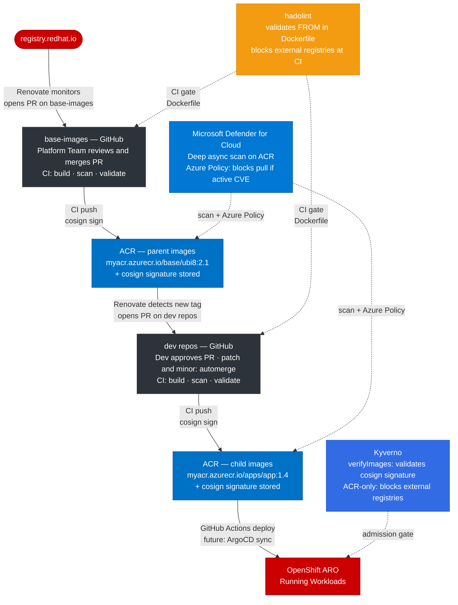
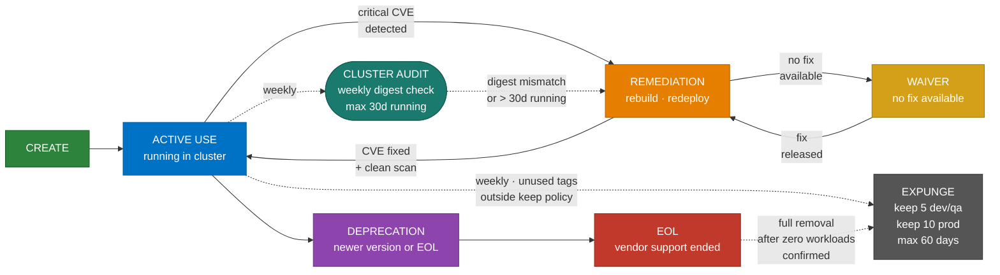
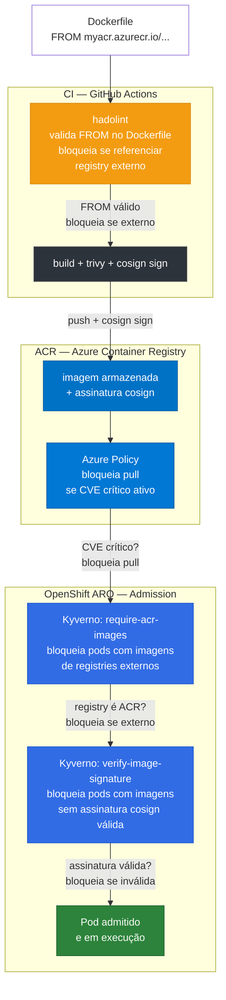

# Ciclo de Vida de Imagens de Container

> **Escopo:** Este documento define o ciclo de vida completo de imagens de container na organização — desde a criação até a remoção — cobrindo gestão de vulnerabilidades, enforcement no OpenShift, processo de remediação e mecanismos para forçar atualizações nos repositórios de desenvolvedores de forma segura e controlada.
>
> **Relação com o Renovate:** A automação de PRs de atualização é descrita em [`readme.md`](./readme.md). Este documento cobre o ciclo mais amplo no qual o Renovate é apenas uma peça.

---

## Referências e Conformidade com Frameworks

Este documento foi elaborado com base nas seguintes referências normativas e frameworks de segurança. O mapeamento indica quais seções deste documento atendem a cada controle.

### ISO/IEC 27001:2022

| Controle | Descrição | Seção deste documento | Conformidade |
|---|---|---|---|
| A.8.1 | Inventário de ativos | 3.3 — Uso ativo, auditoria de imagens em execução | ✅ Atendido |
| A.12.4 | Logging e monitoramento | — | ⚠️ Lacuna — sem política de retenção de logs |
| A.12.5.1 | Controle de software em produção | 6 — Enforcement (Kyverno, cosign) | ✅ Atendido |
| A.12.6.1 | Gestão de vulnerabilidades técnicas | 5 — SLAs de remediação, fluxo completo | ✅ Atendido |
| A.14.2.1 | Segurança no desenvolvimento | 3 — Gates de CI, trivy, GHAS | ✅ Atendido |
| A.14.2.5 | Princípios de engenharia segura | 2 — Camadas de segurança | ✅ Atendido |
| A.17.1 | Continuidade de segurança da informação | 9 — Runbooks | ✅ Atendido |

### NIST SP 800-190 — Application Container Security Guide

| Seção NIST | Descrição | Seção deste documento | Conformidade |
|---|---|---|---|
| 4.1 | Vulnerabilidades em imagens | 5 — Gestão de vulnerabilidades | ✅ Atendido |
| 4.2 | Configuração incorreta de imagens | 3.1, 3.2 — Gates de CI, Dockerfile validation | ✅ Atendido |
| 4.3 | Malware embarcado | 2.2 (GHAS), 2.3 (trivy) | ✅ Atendido |
| 4.4 | Segredos em texto claro | 2.2 — GHAS secret scanning | ✅ Atendido |
| 4.5 | Uso de imagens não confiáveis | 2.5 — cosign + Kyverno verifyImages | ✅ Atendido |
| 5.1 | Acesso irrestrito ao cluster | 6 — Kyverno policies, ACR-only | ✅ Atendido |
| 6.1 | Runtime security | — | ⚠️ Gap conhecido — Defender runtime não suportado no OpenShift ARO. Mitigado por Azure Policy (pull-time) e Kyverno (admission). |

### CIS Kubernetes Benchmark

| Controle CIS | Descrição | Seção deste documento | Conformidade |
|---|---|---|---|
| 4.1 | Imagens devem ser escaneadas | 2.3 (trivy), 2.4 (Defender) | ✅ Atendido |
| 4.2 | Imagens devem ser atualizadas | `readme.md` — Renovate Bot | ✅ Atendido |
| 4.6 | Imagens não devem ser modificadas em runtime | 2.5 — cosign + Kyverno verifyImages | ✅ Atendido |
| 4.7 | Apenas imagens autorizadas devem ser usadas | 6.1 — Kyverno ACR-only policy | ✅ Atendido |
| 5.1 | Evitar sprawl de imagens (image sprawl) | 4 — Expurgo de imagens no ACR | ✅ Atendido |

### SLSA — Supply Chain Levels for Software Artifacts

| Nível | Requisito | Implementação | Conformidade |
|---|---|---|---|
| L1 | Build via processo automatizado e documentado | GitHub Actions | ✅ Atendido |
| L2 | Build service hospedado + provenance básico | GitHub Actions + cosign sign | ✅ Atendido |
| L3 | Integridade de source e build, assinatura verificável | cosign + Kyverno verifyImages | ✅ Atendido |
| L3 | SBOM — Software Bill of Materials | — | ⚠️ Lacuna — SBOM não gerado no pipeline CI |

### Resumo de lacunas identificadas

| # | Lacuna | Framework | Impacto | Recomendação |
|---|---|---|---|---|
| 1 | Sem política de retenção de logs de auditoria (Kyverno, GitHub Actions, ACR) | ISO 27001 A.12.4 | Médio — dificulta auditoria forense | Definir retenção mínima de 90 dias para logs de CI e eventos Kyverno |
| 2 | Sem runtime security no cluster | NIST 800-190 6.1 | Médio — comportamento anômalo de containers não é detectado em tempo real | Gap conhecido e documentado. Limitação do OpenShift ARO. Reavaliar quando suporte Defender for ARO for disponibilizado pela Microsoft |
| 3 | Sem geração de SBOM no pipeline CI | SLSA L3 | Baixo — reduz rastreabilidade de componentes por imagem | Adicionar step `syft` ou `trivy sbom` ao pipeline para gerar e armazenar SBOM no ACR como artefato OCI |

---

---

## Índice

1. [Visão Geral do Ciclo de Vida](#1-visão-geral-do-ciclo-de-vida)
2. [Camadas de Segurança](#2-camadas-de-segurança)
3. [Stages de uma Imagem](#3-stages-de-uma-imagem)
4. [Expurgo de Imagens no ACR](#4-expurgo-de-imagens-no-acr)
5. [Gestão de Vulnerabilidades](#5-gestão-de-vulnerabilidades)
6. [Enforcement no OpenShift](#6-enforcement-no-openshift)
7. [Forçar Atualização nos Repos de Dev](#7-forçar-atualização-nos-repos-de-dev)
8. [Papéis e Responsabilidades](#8-papéis-e-responsabilidades)
9. [Runbooks](#9-runbooks)

---

## 1. Visão Geral do Ciclo de Vida

### 1.1 Cadeia completa de uma imagem

Toda imagem em execução no OpenShift percorre obrigatoriamente esta cadeia. Não existe atalho — imagens externas são bloqueadas pelo cluster.

#### Por que duas camadas de imagem?

A cadeia é dividida em dois níveis deliberadamente: **imagens pai** (base-images) e **imagens filhas** (dev repos). Essa separação existe por uma razão de governança — centralizar o controle de segurança em um único ponto sem bloquear a autonomia dos times de desenvolvimento.

Sem essa hierarquia, cada time de dev seria responsável por monitorar o ciclo do Red Hat, interpretar CVEs de UBI e decidir quando atualizar sua base. Com ela, o Platform Team absorve esse trabalho e os times de dev herdam as atualizações automaticamente — sem precisar acompanhar o `registry.redhat.io`.

O efeito prático é direto: um CVE crítico em UBI 8 gera **um único PR** no `base-images`. Quando o Platform Team aprova e o CI empurra a nova tag para o ACR, o Renovate automaticamente detecta a nova tag e abre PRs em **todos os repos de dev** que usam aquela base. A correção se propaga para toda a organização sem coordenação manual.

#### Nível 1 — Imagens pai (base-images)

O `base-images` é o repositório central do Platform Team. É aqui que vivem os Dockerfiles das imagens base da organização — construídas sobre as imagens oficiais Red Hat UBI.

**Fluxo:**
1. Red Hat publica uma nova tag no `registry.redhat.io` (ex: `ubi8:8.10-1234`)
2. Renovate detecta a nova tag e abre um PR no `base-images` com a atualização do `FROM`
3. O Platform Team revisa e aprova o PR — patches e minors podem ter automerge; majors exigem aprovação explícita
4. O CI executa: `hadolint` valida o Dockerfile, `trivy` escaneia a imagem construída (gate: CVE crítico bloqueia o push)
5. Se aprovado: push da nova tag no ACR (`myacr.azurecr.io/base/ubi8:2.1`)
6. `cosign sign` assina a imagem — a assinatura fica armazenada no ACR junto com o manifest

O Platform Team **não aprova CVEs** — aprova o Dockerfile e a tag. A decisão de segurança é delegada ao `trivy` no CI e ao Defender for Cloud no ACR.

#### Nível 2 — Imagens filhas (dev repos)

Os repos de desenvolvimento constroem suas imagens usando as imagens pai do ACR como base — nunca diretamente do `registry.redhat.io`. O `hadolint` enforça isso no CI.

**Fluxo:**
1. Renovate detecta a nova tag da imagem pai no ACR e abre um PR no repo de dev com a atualização do `FROM`
2. O time de dev revisa — patches e minors com automerge disponível; majors exigem aprovação
3. CI executa: `hadolint` valida que o `FROM` aponta para o ACR interno, `trivy` escaneia a imagem filha
4. Push da nova tag no ACR (`myacr.azurecr.io/apps/app:1.4`)
5. `cosign sign` assina a imagem filha
6. GitHub Actions faz deploy no OpenShift ARO

#### Controles de segurança na cadeia

Os três controles que atuam horizontalmente em toda a cadeia:

| Controle | Onde atua | O que garante |
|---|---|---|
| **hadolint** | CI — antes do build | `FROM` aponta apenas para o ACR interno; nenhuma imagem de registry externo entra |
| **Defender for Cloud** | ACR — após o push | Scan profundo async; Azure Policy bloqueia pull de imagens com CVE crítico ativo |
| **Kyverno** | OpenShift — admission | Valida assinatura cosign antes de admitir qualquer pod; bloqueia imagens não-ACR no cluster |

Nenhum dos três depende do outro — são camadas independentes. Se o `trivy` falhar em detectar um CVE no CI, o Defender pega no ACR. Se uma imagem passar pelo Defender sem assinatura válida, o Kyverno bloqueia no cluster. A sobreposição é intencional.



### 1.2 Stages do ciclo de vida

Cada imagem — pai ou filha — passa pelos seguintes stages ao longo de sua vida:



#### Cluster Audit — imagens em execução no OpenShift

**O problema:** o expurgo de tags no ACR controla o que existe no registry. Mas uma imagem pode ser removida do ACR e continuar a correr no cluster — ou simplesmente nunca ter sido atualizada porque o time não fez deploy da nova versão. O boss não quer imagens antigas no cluster; a política de expurgo do ACR não resolve isso.

**A solução: audit semanal dos pods em execução.** Um GitHub Actions com cron verifica semanalmente o digest de todas as imagens a correr no OpenShift e compara com o digest mais recente e assinado no ACR. Se divergir — ou se a imagem está há mais de 30 dias no cluster sem redeploy — o workflow aciona um `kubectl rollout restart` ou abre um alerta para o time.

```yaml
# .github/workflows/cluster-image-audit.yml
name: Cluster Image Age Audit

on:
  schedule:
    - cron: '0 8 * * 1'  # toda segunda-feira às 08h
  workflow_dispatch:

jobs:
  audit:
    runs-on: ubuntu-latest
    steps:
      - name: Login ACR
        run: az acr login --name myacr

      - name: Get running image digests from OpenShift
        run: |
          oc get pods -A -o jsonpath='{range .items[*]}{.metadata.namespace}{"\t"}{.metadata.name}{"\t"}{.status.containerStatuses[*].imageID}{"\n"}{end}' \
            > running-images.txt
          cat running-images.txt

      - name: Compare with latest ACR digest
        run: |
          STALE=false
          while IFS=$'\t' read -r NS POD IMAGEID; do
            IMAGE=$(echo "$IMAGEID" | grep -oP 'myacr\.azurecr\.io[^\s@]+')
            [ -z "$IMAGE" ] && continue

            ACR_DIGEST=$(az acr repository show-manifests \
              --name myacr --repository "${IMAGE%%:*}" \
              --query "[?tags[0]=='latest'].digest | [0]" -o tsv)

            RUNNING_DIGEST=$(echo "$IMAGEID" | grep -oP 'sha256:[a-f0-9]+')

            if [ "$RUNNING_DIGEST" != "$ACR_DIGEST" ]; then
              echo "::warning::$NS/$POD running stale image — digest mismatch"
              STALE=true
            fi
          done < running-images.txt

          if [ "$STALE" = true ]; then exit 1; fi

      - name: Check running image age (max 30 days)
        run: |
          CUTOFF=$(date -d "-30 days" +%s)
          oc get pods -A -o json | jq -r '
            .items[] |
            select(.status.containerStatuses != null) |
            .metadata.namespace + "\t" + .metadata.name + "\t" +
            (.status.containerStatuses[].state.running.startedAt // "")
          ' | while IFS=$'\t' read -r NS POD STARTED; do
            [ -z "$STARTED" ] && continue
            STARTED_EPOCH=$(date -d "$STARTED" +%s)
            if [ "$STARTED_EPOCH" -lt "$CUTOFF" ]; then
              echo "::warning::$NS/$POD has been running for more than 30 days — force redeploy required"
            fi
          done
```

**Política de idade máxima no cluster:** nenhum pod deve correr a mesma imagem por mais de **30 dias** sem redeploy. Este limite garante que:
- Patches de segurança publicados pela Red Hat chegam ao cluster dentro do ciclo de atualização do Renovate
- O digest em execução no cluster está sempre próximo do digest assinado no ACR
- Um eventual CVE que escapou ao trivy e ao Defender é substituído no próximo ciclo, mesmo sem alerta ativo

> **Nota:** o limite de 30 dias no cluster é independente do limite de 60 dias de tags no ACR. O ACR guarda o histórico de tags para rollback. O cluster só deve ter a versão mais recente a correr.

#### Como identificar o owner e comunicar ao time

O audit semanal só é útil se, ao encontrar uma imagem stale, souber **quem notificar** e **como notificar**. O mecanismo de ownership é baseado em labels de namespace no OpenShift — cada namespace declara explicitamente o time responsável, o repo GitHub e o canal de Slack.

**Passo 1 — Labels obrigatórias em cada namespace:**

```yaml
# oc apply -f namespace-payments.yml
apiVersion: v1
kind: Namespace
metadata:
  name: payments
  labels:
    team: "payments"
    github-repo: "org/payments-service"   # repo onde abrir Issues
    slack-channel: "C0123ABCDEF"          # Slack channel ID do time
    contact-email: "payments-lead@company.com"
```

Estes labels são a fonte de verdade de ownership. O Platform Team é responsável por garantir que todos os namespaces os têm antes de qualquer workload ser deployado. Namespaces sem labels não passam na validação do Kyverno (pode ser adicionada uma policy `require-namespace-labels`).

**Passo 2 — Workflow de notificação automática:**

Quando o audit detecta uma imagem stale, lê os labels do namespace e aciona a comunicação sem intervenção manual:

```yaml
# .github/workflows/cluster-image-audit.yml (secção de notificação)
      - name: Notify owners of stale images
        env:
          GH_TOKEN: ${{ secrets.GITHUB_TOKEN }}
          SLACK_BOT_TOKEN: ${{ secrets.SLACK_BOT_TOKEN }}
        run: |
          while IFS=$'\t' read -r NS POD IMAGE DAYS; do
            # Ler labels do namespace
            GITHUB_REPO=$(oc get namespace "$NS" -o jsonpath='{.metadata.labels.github-repo}')
            SLACK_CHANNEL=$(oc get namespace "$NS" -o jsonpath='{.metadata.labels.slack-channel}')
            CONTACT=$(oc get namespace "$NS" -o jsonpath='{.metadata.labels.contact-email}')

            ISSUE_TITLE="[Image Audit] Stale image in $NS — $IMAGE ($DAYS days)"
            ISSUE_BODY="## Imagem desatualizada detectada

**Namespace:** \`$NS\`
**Pod:** \`$POD\`
**Imagem:** \`$IMAGE\`
**Dias em execução sem redeploy:** $DAYS dias

### O que fazer

1. Verifique se existe um PR do Renovate aberto no seu repo com atualização da imagem base
2. Se sim: aprove e faça merge — o pipeline fará o redeploy automaticamente
3. Se não: abra um PR atualizando o \`FROM\` do Dockerfile para a tag mais recente no ACR
4. Confirme o redeploy no cluster em até **7 dias**

### Política

Imagens não podem correr por mais de **30 dias** sem redeploy (política de ciclo de vida).
Após 14 dias sem resposta, o Platform Team pode forçar o redeploy.

> Gerado automaticamente pelo cluster image audit — $(date -u +%Y-%m-%dT%H:%M:%SZ)"

            # Abrir Issue no repo do time (evita duplicatas verificando Issues abertas)
            EXISTING=$(gh issue list --repo "$GITHUB_REPO" \
              --search "$NS $IMAGE in:title" --state open --json number -q '.[0].number')

            if [ -z "$EXISTING" ]; then
              gh issue create \
                --repo "$GITHUB_REPO" \
                --title "$ISSUE_TITLE" \
                --body "$ISSUE_BODY" \
                --label "image-audit,security"
              echo "Issue aberta em $GITHUB_REPO"
            else
              echo "Issue #$EXISTING já existe em $GITHUB_REPO — ignorando"
            fi

            # Notificar no Slack
            curl -s -X POST https://slack.com/api/chat.postMessage \
              -H "Authorization: Bearer $SLACK_BOT_TOKEN" \
              -H "Content-Type: application/json" \
              -d "{
                \"channel\": \"$SLACK_CHANNEL\",
                \"text\": \":warning: *Image Audit* — \`$NS/$POD\` está a correr \`$IMAGE\` há *$DAYS dias* sem redeploy. Issue aberta em <https://github.com/$GITHUB_REPO|$GITHUB_REPO>. Prazo: 7 dias.\"
              }"

          done < stale-images.txt
```

**Passo 3 — Política de escalação:**

| Dia | Acção automática | Responsável |
|---|---|---|
| Dia 1 | GitHub Issue aberta + mensagem no Slack do time | Workflow automático |
| Dia 7 | Comentário na Issue + nova mensagem Slack com menção ao lead | Workflow automático |
| Dia 14 | Escalada para o canal do Platform Team + email ao `contact-email` | Workflow automático |
| Dia 30 | Platform Team força `kubectl rollout restart` no namespace | Platform Team |

```yaml
# Escalação no dia 14 — step adicional no workflow
      - name: Escalate overdue issues (14+ days open)
        env:
          GH_TOKEN: ${{ secrets.GITHUB_TOKEN }}
          SLACK_BOT_TOKEN: ${{ secrets.SLACK_BOT_TOKEN }}
        run: |
          CUTOFF_DATE=$(date -d "-14 days" +%Y-%m-%dT%H:%M:%SZ)

          gh issue list --repo "org/payments-service" \
            --label "image-audit" --state open \
            --json number,title,createdAt \
            --jq ".[] | select(.createdAt < \"$CUTOFF_DATE\") | .number" \
          | while read -r ISSUE_NUM; do
              gh issue comment "org/payments-service" --issue "$ISSUE_NUM" \
                --body "⚠️ **14 dias sem resposta.** Escalando para o Platform Team. Redeploy forçado agendado para o dia 30."

              # Notificar canal do Platform Team
              curl -s -X POST https://slack.com/api/chat.postMessage \
                -H "Authorization: Bearer $SLACK_BOT_TOKEN" \
                -H "Content-Type: application/json" \
                -d "{
                  \"channel\": \"$PLATFORM_SLACK_CHANNEL\",
                  \"text\": \":rotating_light: Issue #$ISSUE_NUM sem resposta há 14 dias — considerar redeploy forçado\"
                }"
            done
```

> **CODEOWNERS como fallback:** se o namespace não tiver o label `github-repo`, o workflow usa o arquivo `CODEOWNERS` do repositório base-images para identificar o time responsável pela imagem pai e notifica os revisores listados.

#### Remediação — como funciona na prática

**O que dispara:** Um CVE crítico é detectado pelo Defender for Cloud (scan async no ACR, contínuo) ou pelo trivy (gate no CI durante um novo build). Ambos produzem alertas com CVE ID, severidade, camada afetada e disponibilidade de fix.

**O processo de remediação:**

1. Defender ou trivy identificam CVE crítico na imagem em uso
2. Se a base foi atualizada pelo Renovate → já existe PR aberto com a correção; o time aprova e faz merge
3. Se não existe PR → o time abre manualmente apontando para a nova tag da imagem pai
4. CI rebuild: nova tag é construída, trivy gate roda, se limpo faz push no ACR com nova tag
5. Cosign assina a nova imagem no ACR
6. Deploy no OpenShift com a nova tag
7. Defender confirma scan limpo na nova imagem → remediação fechada

**Critério de fechamento:** deploy da nova tag confirmado no cluster **e** Defender for Cloud sem alertas críticos ativos na imagem. Não basta o rebuild — a confirmação do Defender fecha o ciclo.

**CVE sem fix disponível — Waiver:**
Quando o CVE crítico não tem patch publicado pelo fornecedor (`ignore-unfixed: true` no trivy), a imagem entra em **Waiver**. O waiver exige:
- Justificativa documentada (CVE ID, motivo da ausência de fix, mitigações compensatórias em vigor)
- Data máxima de revisão (recomendado: 30 dias)
- Aprovação explícita do time de segurança

O waiver não é aceitação permanente — é um prazo controlado. Quando o fix for publicado, a imagem retorna ao fluxo de remediação.

#### EOL — origem e referências

EOL (**End of Life**) marca o ponto em que o fornecedor da imagem base encerra o suporte de segurança. A partir do EOL, CVEs descobertos na versão não recebem mais patches — tornar-se vulnerabilidades permanentes e não remediáveis.

**De onde vem o EOL das suas imagens:**

| Imagem base | Fonte do EOL | Exemplo |
|---|---|---|
| Red Hat UBI 8 | [Red Hat Product Life Cycle](https://access.redhat.com/product-life-cycle) | RHEL 8 → Maio 2029 |
| Red Hat UBI 9 | Red Hat Product Life Cycle | RHEL 9 → Maio 2032 |
| UBI minimal / micro | Mesmo ciclo da versão RHEL correspondente | Herda da versão pai |

O Renovate monitora as tags publicadas pelo fornecedor mas **não sabe que uma versão atingiu EOL** — isso é um dado publicado pela Red Hat fora das tags de imagem. O controle de EOL é responsabilidade manual do time, com revisão periódica das datas publicadas.

**O Defender for Cloud detecta EOL?**

Sim — mas de forma **reactiva**. Quando uma imagem base atinge EOL, o Defender (via Microsoft Defender Vulnerability Management) classifica o próprio OS da imagem como uma finding de vulnerabilidade. No portal do Defender for Cloud aparece como recomendação do tipo _"Container images should not use an end-of-life OS"_.

O problema desta detecção é que ela ocorre **depois que o EOL chegou**, não antes. Não há garantia de SLA sobre quanto tempo demora entre o EOL oficial publicado pela Red Hat e a atualização da base de dados do Defender. Para fins de compliance (ISO 27001 A.12.6.1), confiar exclusivamente no Defender para detetar EOL é um risco — a imagem pode estar em violação por semanas antes de aparecer como finding.

**Detecção proactiva — GitHub Actions com alerta de 90 dias:**

A abordagem correcta é combinar o Defender (detecção reactiva) com um workflow de cron semanal que verifica as datas de EOL conhecidas e emite alerta com antecedência suficiente para o time planear a migração antes de entrar em violação:

```yaml
# .github/workflows/check-image-eol.yml
name: Check Image EOL

on:
  schedule:
    - cron: '0 9 * * 1'  # toda segunda-feira às 09h
  workflow_dispatch:

jobs:
  check-eol:
    runs-on: ubuntu-latest
    steps:
      - name: Verificar datas de EOL das imagens base
        run: |
          # Atualizar estas datas conforme Red Hat Product Life Cycle
          # https://access.redhat.com/product-life-cycle
          declare -A EOL_DATES=(
            ["UBI8"]="2029-05-31"
            ["UBI9"]="2032-05-31"
          )

          TODAY=$(date +%Y-%m-%d)
          WARN_THRESHOLD=$(date -d "+90 days" +%Y-%m-%d)
          FOUND_ISSUE=false

          for IMAGE in "${!EOL_DATES[@]}"; do
            EOL="${EOL_DATES[$IMAGE]}"

            if [[ "$TODAY" > "$EOL" ]]; then
              echo "::error::$IMAGE atingiu EOL em $EOL — migração obrigatória imediata"
              FOUND_ISSUE=true
            elif [[ "$WARN_THRESHOLD" > "$EOL" ]]; then
              echo "::warning::$IMAGE atinge EOL em $EOL — menos de 90 dias restantes"
              FOUND_ISSUE=true
            else
              echo "✅ $IMAGE — EOL em $EOL (OK)"
            fi
          done

          if [ "$FOUND_ISSUE" = true ]; then
            exit 1  # falha o workflow → GitHub notifica via email e cria alerta no repo
          fi
```

> **Importante:** As datas no workflow são estáticas — precisam ser atualizadas manualmente quando a Red Hat publicar novos ciclos, ou quando uma nova versão de UBI for adoptada. Recomenda-se rever este arquivo a cada novo ano fiscal.

**Referências normativas:**

- **NIST SP 800-190 §4.1** — recomenda explicitamente o uso de imagens provenientes de fontes ativamente mantidas; imagens EOL violam este requisito
- **ISO 27001 A.12.6.1** — Gestão de vulnerabilidades técnicas: software fora de suporte é tratado como vulnerabilidade técnica. Uma imagem EOL equivale a uma vulnerabilidade sem possibilidade de remediação — situação que a norma exige que seja gerida e documentada
- **CIS Kubernetes Benchmark 5.1.1** — use only approved base images, que implicitamente exclui versões sem suporte ativo do fornecedor

**O que fazer quando uma imagem pai atinge EOL:**
A imagem entra em **Deprecação** imediatamente. Todos os repos de dev que a usam como base devem migrar para a versão suportada seguinte (ex: UBI 8 → UBI 9) antes da data de EOL. O Renovate não abre esse PR automaticamente porque é uma mudança de major version — exige aprovação explícita via `dependencyDashboardApproval: true`.

> **Expurgo acontece em dois momentos** — continuamente durante o uso ativo (tags antigas além do keep) e na saída do EOL (remoção total após confirmar zero workloads no cluster).

---

## 2. Camadas de Segurança

O modelo usa três ferramentas complementares que atuam em momentos diferentes do ciclo. Nenhuma substitui a outra — cada uma cobre um ponto cego das demais.

### 2.1 Visão geral das camadas

| Momento | Ferramenta | O que faz | Bloqueia? |
|---|---|---|---|
| PR aberto (GitHub) | GHAS | Dependency review, secret scanning, CodeQL | Sim — bloqueia merge |
| CI executa (antes do push) | trivy | Gate rápido de CVE crítico em imagem | Sim — bloqueia push |
| CI após push no ACR | cosign | Assina a imagem com chave do CI | Não bloqueia — habilita validação |
| Após push no ACR | Defender for Cloud | Scan profundo e contínuo das imagens | Sim — via Azure Policy |
| Pull pelo OpenShift | Azure Policy + Defender | Bloqueia pull de imagens com CVE ativo | Sim — 403 no ACR |
| Admission no OpenShift | Kyverno verifyImages | Valida assinatura cosign antes de admitir pod | Sim — pod não sobe |

> **Defender runtime não está ativo no OpenShift ARO** — a instalação dos agents Defender no ARO não é suportada no ambiente atual. O enforcement no cluster é feito inteiramente via Kyverno.

### 2.2 GHAS — GitHub Advanced Security

O GHAS atua na camada do repositório GitHub — antes de qualquer build ou push. Cobre três frentes:

**Dependency Review:** analisa o diff de cada PR e bloqueia merge se introduzir dependência com CVE conhecida. No contexto de Dockerfiles, complementa o Renovate — enquanto o Renovate garante que você está na versão mais recente, o GHAS garante que o PR não está introduzindo uma dependência vulnerável ao lado.

**Secret Scanning:** detecta credenciais expostas em commits — tokens, chaves de API, senhas em Dockerfiles ou scripts de CI. Alerta imediatamente e pode bloquear o push.

**Code Scanning (CodeQL):** análise estática do código fonte da aplicação. Mais relevante nos repos de dev que têm código além do Dockerfile.

```yaml
# .github/workflows/ghas.yml — já habilitado automaticamente
# com GHAS pago, basta garantir que está ativo nas configurações do repo:
# Settings → Code security and analysis → Enable all
```

> **Importante:** GHAS não escaneia a imagem Docker construída — escaneia o código fonte e as dependências declaradas. O scan da imagem em si é responsabilidade do trivy (CI) e do Defender (ACR).

### 2.3 trivy — gate no CI

O trivy roda dentro do pipeline de CI exclusivamente como **gate de build-time**. Sua função é simples: se a imagem construída tem CVE crítico, o pipeline falha e o push no ACR não acontece.

```yaml
# Exemplo de step no GitHub Actions
- name: Scan de segurança com trivy
  uses: aquasecurity/trivy-action@master
  with:
    image-ref: myacr.azurecr.io/base/ubi8:${{ env.TAG }}
    severity: CRITICAL
    exit-code: 1          # falha o pipeline se encontrar CVE crítico
    ignore-unfixed: true  # ignora CVEs sem patch disponível
```

O trivy não é o scanner principal de observabilidade — ele é o freio de emergência antes do push. Scans contínuos e de longo prazo são responsabilidade do Defender.

### 2.4 Microsoft Defender for Cloud

O Defender opera em duas camadas no ACR. **Runtime protection no cluster não está ativo** — a instalação dos agents no OpenShift ARO não é suportada no ambiente atual.

#### Scan de imagens no ACR

Toda imagem empurrada para o ACR é automaticamente escaneada pelo Defender — sem configuração adicional no CI. O resultado aparece no portal do Defender for Cloud com:
- Lista de CVEs por severidade
- Camada da imagem onde o CVE está presente
- Disponibilidade de fix
- Score de risco agregado

Isso cria uma **segunda opinião independente** do trivy. Se os dois discordarem sobre um CVE, você tem evidência de duas fontes para a decisão de waiver ou remediação.

#### Azure Policy — bloqueio de pull

O Defender integra com Azure Policy para impedir que o OpenShift faça pull de imagens com CVEs críticos ativos — mesmo que a imagem já esteja no ACR:

```json
{
  "displayName": "Bloquear pull de imagens com vulnerabilidades críticas",
  "policyRule": {
    "if": {
      "allOf": [
        {
          "field": "type",
          "equals": "Microsoft.ContainerRegistry/registries/images"
        },
        {
          "field": "Microsoft.Security/assessments/status/code",
          "equals": "Unhealthy"
        }
      ]
    },
    "then": {
      "effect": "deny"
    }
  }
}
```

**O que isso resolve na prática:** um CVE pode ser descoberto dias ou semanas após o push de uma imagem. Sem Azure Policy, a imagem vulnerável continua disponível para pull normalmente. Com a policy ativa, assim que o Defender classifica a imagem como vulnerável, novos pulls são negados — mesmo sem recriar o CI.

### 2.5 Assinatura de imagens com cosign + validação Kyverno

A assinatura de imagens resolve um problema que nem o trivy nem o Defender cobrem: **garantir que apenas imagens produzidas pelo seu CI autorizado chegam ao cluster** — e não imagens construídas manualmente, empurradas por um pipeline comprometido ou trazidas de fora do ACR.

#### Como funciona

```
CI conclui build + trivy passa
          │
          ▼
cosign sign -- com chave privada do CI
          │
          ▼
Assinatura armazenada no ACR junto à imagem
(como artefato OCI separado da imagem)
          │
          ▼
GitHub Actions faz deploy → OpenShift recebe o pod
          │
          ▼
Kyverno intercepta o request de criação do pod
Chama ACR para verificar a assinatura cosign
com a chave pública configurada na policy
          │
    ┌─────┴─────┐
    │           │
 Válida      Inválida ou ausente
    │           │
    ▼           ▼
 Pod sobe   Pod BLOQUEADO
            Evento registrado no audit log
```

#### Step de assinatura no GitHub Actions

```yaml
- name: Login no ACR
  uses: azure/docker-login@v1
  with:
    login-server: myacr.azurecr.io
    username: ${{ secrets.ACR_USERNAME }}
    password: ${{ secrets.ACR_PASSWORD }}

- name: Build e push da imagem
  run: |
    docker build -t myacr.azurecr.io/base/ubi8:${{ env.TAG }} .
    docker push myacr.azurecr.io/base/ubi8:${{ env.TAG }}

- name: Assinar imagem com cosign
  env:
    COSIGN_PRIVATE_KEY: ${{ secrets.COSIGN_PRIVATE_KEY }}
    COSIGN_PASSWORD: ${{ secrets.COSIGN_PASSWORD }}
  run: |
    cosign sign --key env://COSIGN_PRIVATE_KEY \
      myacr.azurecr.io/base/ubi8:${{ env.TAG }}
```

> A chave privada fica em GitHub Secrets. A chave pública correspondente é distribuída para o Kyverno via ConfigMap ou Secret no cluster.

#### Policy Kyverno — validação de assinatura

```yaml
apiVersion: kyverno.io/v1
kind: ClusterPolicy
metadata:
  name: verify-image-signature
  annotations:
    policies.kyverno.io/description: >
      Bloqueia pods com imagens não assinadas pelo CI autorizado.
      Garante que apenas imagens produzidas pelo pipeline
      oficial chegam ao cluster.
spec:
  validationFailureAction: Enforce
  rules:
    - name: check-cosign-signature
      match:
        resources:
          kinds:
            - Pod
      verifyImages:
        - imageReferences:
            - "myacr.azurecr.io/*"
          attestors:
            - entries:
                - keys:
                    publicKeys: |-
                      -----BEGIN PUBLIC KEY-----
                      <chave pública cosign do CI>
                      -----END PUBLIC KEY-----
```

#### O que esta policy garante

| Cenário | Resultado |
|---|---|
| Imagem construída e assinada pelo CI | Pod sobe normalmente |
| Imagem do ACR sem assinatura (push manual) | Pod bloqueado |
| Imagem de registry externo | Pod bloqueado (pela policy de ACR + por falta de assinatura) |
| Imagem assinada com chave diferente (pipeline comprometido) | Pod bloqueado |
| Imagem com assinatura expirada ou corrompida | Pod bloqueado |

> **Complementaridade com Azure Policy:** o Azure Policy bloqueia o **pull** de imagens com CVE no ACR. O Kyverno verifyImages bloqueia o **admission** de imagens sem assinatura válida no cluster. São dois gates independentes em camadas diferentes.

### 2.6 Quando cada ferramenta detecta o problema

O mesmo CVE pode ser detectado em momentos diferentes dependendo de quando foi publicado:

```
CVE publicado ANTES do push:
  → trivy detecta no CI → push bloqueado → imagem nunca chega ao ACR

CVE publicado DEPOIS do push (imagem já no ACR):
  → Defender detecta na varredura contínua do ACR
  → Azure Policy bloqueia novos pulls
  → Renovate abre PR de patch quando Red Hat publicar fix
  → Trivy confirma no CI do PR de fix antes do novo push

CVE publicado DEPOIS do deploy (container em execução):
  → Sem detecção automática em runtime (Defender agents não disponíveis no ARO)
  → Defender detecta na varredura contínua do ACR e Azure Policy bloqueia novos pulls
  → Kyverno bloqueia novos pods com a imagem vulnerável no admission
  → Renovate abre PR de patch quando Red Hat publicar fix
```

---

## 3. Stages de uma Imagem

### 3.1 Criação — imagem pai

Uma nova imagem pai nasce quando:
- O Renovate detecta nova versão no `registry.redhat.io` e abre PR no `base-images`
- A equipe de Plataforma cria proativamente uma nova imagem base (ex: nova stack de runtime)

**Gates obrigatórios antes do push no ACR:**

| Gate | O que valida | Falha bloqueia merge? |
|---|---|---|
| `validate-dockerfile` | FROM com digest sha256 | Sim |
| `image-build` | Build bem-sucedido | Sim |
| `image-scan` | Sem CVEs críticos (trivy/grype) | Sim |
| `tag-validator` | Tag segue `major.minor.patch-build` | Sim |
| Revisão humana | Release notes linkadas na descrição do PR | Sim |

Somente após todos os gates e o merge do PR o CI faz push da imagem pai para o ACR.

### 3.2 Criação — imagem filha

Uma imagem filha nasce quando o Renovate detecta a nova tag da imagem pai no ACR e abre PR no repo de dev. O fluxo difere do pai em dois pontos:

- **Patch e minor:** automerge se CI verde — o dev não precisa intervir
- **Major:** PR fica bloqueado no Dependency Dashboard até aprovação explícita do dev

**Gates obrigatórios antes do push no ACR:**

| Gate | O que valida | Falha bloqueia merge? |
|---|---|---|
| `validate-dockerfile` | FROM sem digest (só tag) | Sim |
| `image-build` | Build bem-sucedido | Sim |
| `image-scan` | Sem CVEs críticos | Sim |

### 3.3 Uso ativo

Após publicada no ACR e deployada no OpenShift, a imagem entra em uso ativo. Neste stage:

- Scans são executados a cada PR no CI e em varreduras agendadas nas imagens em execução no cluster
- O Renovate continua monitorando e abrindo PRs de atualização conforme novas versões surgem
- A equipe de Plataforma acompanha erratas de segurança da Red Hat e do NVD

**Verificar imagens em execução no cluster:**

```bash
# Listar todas as imagens únicas rodando no cluster
oc get pods -A -o jsonpath='{range .items[*]}{.spec.containers[*].image}{"\n"}{end}' \
  | sort -u

# Escanear uma imagem específica
trivy image myacr.azurecr.io/base/ubi8:2.1 \
  --severity CRITICAL,HIGH \
  --exit-code 1
```

### 3.4 Remediação

A remediação começa quando um CVE é detectado e termina somente quando o pod em execução no cluster é atualizado e re-scanado com resultado limpo. O merge do PR é um passo do processo, não o fim.

O fluxo completo está detalhado na [seção 4](#4-gestão-de-vulnerabilidades).

### 3.5 Deprecação

Uma imagem entra em deprecação quando:
- A Red Hat anuncia EOL da versão base (ex: RHEL 8 → RHEL 9)
- A stack de runtime atingiu EOL upstream (ex: Java 11 → Java 21)
- Uma vulnerabilidade estrutural não pode ser corrigida sem troca de geração

**Linha do tempo do processo de deprecação:**

```
Dia 0   → Equipe de Plataforma abre Issue no base-images
           com label `deprecation` documentando:
           - Imagem afetada e motivo
           - Nova imagem substituta disponível no ACR
           - Prazo final de migração (mínimo 60 dias)
           - Lista de repositórios filhos afetados

Dia 0   → Comunicação formal para todos os times de dev

Dia 30  → Relatório: quais repos ainda não abriram PR de migração
           Lembrete para os times atrasados

Dia 45  → Escalação para tech leads dos times sem progresso

Dia 60  → Prazo final — enforcement Warn ativo no cluster

Dia 75  → Enforcement Enforce ativo — novos deploys bloqueados

Dia 90+ → Remoção do ACR após confirmar zero workloads
           usando a imagem (ver seção 3.3)
```

### 3.6 EOL e remoção do ACR

Antes de remover uma imagem do ACR, confirmar que nenhum workload a referencia:

```bash
# Verificar se ainda há pods usando a imagem depreciada
oc get pods -A -o json \
  | jq -r '.items[] | select(.spec.containers[].image | contains("ubi8:1.")) | .metadata.namespace + "/" + .metadata.name'
```

Somente com resultado vazio executar a remoção. Documentar data e motivo na Issue de deprecação — a remoção do ACR é irreversível.

---

## 4. Expurgo de Imagens no ACR

O ACR acumula tags ao longo do tempo — cada build gera uma nova tag. Sem expurgo, o ACR cresce indefinidamente, aumentando custos de storage e dificultando a auditoria de quais versões estão realmente em uso.

### 4.1 Política de retenção

| Ambiente | Tags mantidas por repositório | Idade máxima |
|---|---|---|
| dev / qa | 5 tags mais recentes | 60 dias |
| prod | 10 tags mais recentes | 60 dias |

**Regra de ouro:** uma tag só pode ser expurgada se **não estiver em execução em nenhum pod do cluster**. Independentemente de quantas tags existam ou de sua idade, tags em uso são intocáveis.

### 4.2 Lógica do expurgo

```
Para cada repositório no ACR:
  1. Listar todas as tags ordenadas por data de push (mais recente primeiro)
  2. Consultar o cluster — quais tags estão em uso?
  3. Proteger as N tags mais recentes (5 dev/qa, 10 prod)
  4. Proteger TODAS as tags em uso no cluster (independente da posição)
  5. Marcar para expurgo: tags fora das N mais recentes
                          E com mais de 60 dias
                          E não em uso no cluster
  6. Executar exclusão das marcadas
```

### 4.3 Implementação com GitHub Actions agendado

```yaml
name: ACR Image Expurgo

on:
  schedule:
    - cron: '0 2 * * 0'   # toda domingo às 02h00
  workflow_dispatch:        # execução manual quando necessário

jobs:
  expurgo:
    runs-on: ubuntu-latest
    steps:
      - name: Login no ACR
        uses: azure/docker-login@v1
        with:
          login-server: myacr.azurecr.io
          username: ${{ secrets.ACR_USERNAME }}
          password: ${{ secrets.ACR_PASSWORD }}

      - name: Login no OpenShift
        uses: redhat-actions/oc-login@v1
        with:
          openshift_server_url: ${{ secrets.OC_SERVER }}
          openshift_token: ${{ secrets.OC_TOKEN }}

      - name: Coletar imagens em uso no cluster
        id: in-use
        run: |
          oc get pods -A -o jsonpath='{range .items[*]}{.spec.containers[*].image}{"\n"}{end}' \
            | sort -u > /tmp/images-in-use.txt
          echo "Imagens em uso:"
          cat /tmp/images-in-use.txt

      - name: Executar expurgo
        env:
          KEEP_DEV: 5
          KEEP_PROD: 10
          MAX_AGE_DAYS: 60
        run: |
          REPOS=$(az acr repository list --name myacr --output tsv)
          for REPO in $REPOS; do
            # Determinar ambiente pela convenção de nome do repositório
            if echo "$REPO" | grep -qE "^apps/"; then
              KEEP=$KEEP_PROD
            else
              KEEP=$KEEP_DEV
            fi

            # Listar todas as tags ordenadas por data (mais recente primeiro)
            TAGS=$(az acr repository show-tags \
              --name myacr \
              --repository "$REPO" \
              --orderby time_desc \
              --output tsv)

            COUNT=0
            for TAG in $TAGS; do
              COUNT=$((COUNT + 1))
              IMAGE="myacr.azurecr.io/${REPO}:${TAG}"

              # Proteger as N mais recentes
              if [ $COUNT -le $KEEP ]; then
                echo "MANTÉM (top $KEEP): $IMAGE"
                continue
              fi

              # Proteger imagens em uso no cluster
              if grep -qF "$IMAGE" /tmp/images-in-use.txt; then
                echo "MANTÉM (em uso no cluster): $IMAGE"
                continue
              fi

              # Verificar idade da tag
              PUSH_DATE=$(az acr repository show \
                --name myacr \
                --image "${REPO}:${TAG}" \
                --query lastUpdateTime -o tsv | cut -dT -f1)
              AGE=$(( ( $(date +%s) - $(date -d "$PUSH_DATE" +%s) ) / 86400 ))

              if [ $AGE -ge $MAX_AGE_DAYS ]; then
                echo "EXPURGO ($AGE dias): $IMAGE"
                az acr repository delete \
                  --name myacr \
                  --image "${REPO}:${TAG}" \
                  --yes
              else
                echo "MANTÉM ($AGE dias, abaixo de $MAX_AGE_DAYS): $IMAGE"
              fi
            done
          done
```

### 4.4 Auditoria antes do expurgo

Antes de ativar o expurgo em modo destrutivo, rode em dry-run para validar o que seria removido:

```bash
# Substituir a linha de exclusão por echo para simular
# az acr repository delete ... → echo "SERIA EXPURGADO: $IMAGE"
```

Revisar o output do dry-run e confirmar que nenhuma imagem crítica está na lista antes de executar de verdade.

---

## 5. Gestão de Vulnerabilidades

### 5.1 SLAs de remediação por severidade

| Severidade | CVSS | SLA de remediação | O que acontece se vencer |
|---|---|---|---|
| Crítico | ≥ 9.0 | 24h após detecção | Escalação imediata para liderança técnica |
| Alto | 7.0–8.9 | 72h | Notificação para tech lead do time |
| Médio | 4.0–6.9 | Próxima sprint | Registrado no backlog de segurança |
| Baixo | < 4.0 | Próximo ciclo de patch | Monitoramento passivo |

> **Detecção** conta a partir do momento em que o scan (CI ou agendado) identifica o CVE, não da publicação no NVD.

### 5.2 Processo de remediação — fluxo completo

A remediação **só termina quando o pod em execução no OpenShift é atualizado e re-scanado com resultado limpo**. O merge do PR é um passo intermediário, não o encerramento.

```
1. CVE detectado pelo scan (CI ou varredura agendada no cluster)
         │
         ▼
2. Equipe de Plataforma avalia:
   - CVE está na imagem pai ou na aplicação do dev?
   - Red Hat já publicou errata com patch?
         │
    ┌────┴─────┐
    │          │
   Sim        Não (aguardando Red Hat)
    │          │
    │          ▼
    │     Abre Issue com label `cve-pending`
    │     Documenta CVE, CVSS e workaround temporário
    │     Monitora errata da Red Hat
    │     (fluxo continua quando patch for publicado)
    │
    ▼
3. Renovate detecta nova versão patcheada no registry.redhat.io
   Abre PR no base-images com prPriority: 10
         │
         ▼
4. Equipe de Plataforma revisa e mergea o PR
   CI: build + scan da imagem pai → push no ACR
         │
         ▼
5. Renovate detecta nova tag no ACR
   Abre PRs nos repos de dev (patch: automerge se CI verde)
         │
         ▼
6. CI do repo de dev: build + scan da imagem filha → push no ACR
         │
         ▼
7. GitHub Actions faz deploy da imagem filha no OpenShift
   (futuro: ArgoCD detecta nova tag e faz sync automático)
         │
         ▼
8. Scan pós-deploy confirma que o pod em execução
   não tem mais o CVE
         │
         ▼
9. Issue do CVE fechada com links para:
   - PR do base-images
   - PR do repo de dev
   - Evidência do scan limpo
```

### 5.3 Exceções e waiver temporário

Se um time não consegue remediar dentro do SLA por bloqueio técnico legítimo (ex: incompatibilidade da aplicação com a versão patcheada), deve abrir uma Issue com:

- CVE afetado e severidade
- Motivo técnico do bloqueio
- Plano de mitigação temporária (ex: network policy restritiva, WAF rule)
- Data-alvo de resolução definitiva
- Aprovação do tech lead e da equipe de Segurança

Waivers não podem ultrapassar 30 dias para CVEs críticos.

---

## 6. Enforcement no OpenShift

A regra de que só imagens do ACR são permitidas é enforçada em duas camadas independentes — uma no CI antes do push, outra no cluster no momento do deploy. Se uma falhar, a outra ainda bloqueia.



### 6.1 Política — somente imagens do ACR são permitidas

Nenhum workload no cluster deve executar imagens de registries externos. Toda imagem deve passar pelo pipeline do ACR e pelos gates de qualidade da organização.

**hadolint — gate no CI (antes do build):**

O hadolint valida o Dockerfile antes de qualquer build. Se o `FROM` referenciar um registry que não seja o ACR, o pipeline falha imediatamente — a imagem nem chega a ser construída.

```bash
# Exemplo de configuração .hadolint.yaml
allowed-registries:
  - myacr.azurecr.io
```

```yaml
# Step no GitHub Actions
- name: Lint Dockerfile com hadolint
  uses: hadolint/hadolint-action@v3.1.0
  with:
    dockerfile: Dockerfile
    config: .hadolint.yaml
    failure-threshold: error
```

**Implementação com Kyverno:**

```yaml
apiVersion: kyverno.io/v1
kind: ClusterPolicy
metadata:
  name: require-acr-images
  annotations:
    policies.kyverno.io/description: >
      Bloqueia pods que referenciam imagens fora do ACR interno.
      Todas as imagens devem vir de myacr.azurecr.io.
spec:
  validationFailureAction: Enforce
  rules:
    - name: validate-image-registry
      match:
        resources:
          kinds:
            - Pod
      validate:
        message: >
          Imagens externas não são permitidas. Use apenas
          myacr.azurecr.io. Imagem rejeitada: {{ request.object.spec.containers[].image }}
        pattern:
          spec:
            containers:
              - image: "myacr.azurecr.io/*"
```

> **Modo de rollout:** Inicie com `validationFailureAction: Audit` para mapear violações existentes antes de ativar `Enforce`. Isso evita interrupções em workloads legados.

### 6.2 Auditoria de imagens em execução no cluster

**Listar todas as imagens e suas tags em execução:**

```bash
oc get pods -A -o json \
  | jq -r '.items[] | .metadata.namespace + " | " + .metadata.name + " | " + .spec.containers[].image' \
  | sort | column -t -s "|"
```

**Identificar imagens desatualizadas — comparar com o ACR:**

```bash
# Para cada imagem em execução, verificar se a tag é a mais recente no ACR
az acr repository show-tags \
  --name myacr \
  --repository base/ubi8 \
  --orderby time_desc \
  --top 1
```

**Scan em lote de todas as imagens em execução:**

```bash
oc get pods -A -o jsonpath='{range .items[*]}{.spec.containers[*].image}{"\n"}{end}' \
  | sort -u \
  | xargs -I{} trivy image {} --severity CRITICAL,HIGH --quiet
```

### 6.3 Bloquear imagens com CVE crítico no admission

Além de exigir que imagens venham do ACR, você pode bloquear imagens que não passaram no scan de segurança usando anotações no ACR integradas ao admission controller:

```yaml
# Kyverno — bloqueia imagens sem a anotação de scan aprovado
apiVersion: kyverno.io/v1
kind: ClusterPolicy
metadata:
  name: require-scan-annotation
spec:
  validationFailureAction: Enforce
  rules:
    - name: check-scan-label
      match:
        resources:
          kinds:
            - Pod
      validate:
        message: >
          A imagem não possui anotação de scan aprovado.
          Execute o pipeline de CI antes de fazer deploy.
        pattern:
          metadata:
            annotations:
              security.acr/scan-status: "passed"
```

---

## 7. Forçar Atualização nos Repos de Dev

### 7.1 Como o controle de major/minor/patch funciona sem quebrar apps

O modelo de governança usa três mecanismos complementares para garantir que devs atualizem sem risco de quebrar aplicações:

| Tipo | Mecanismo | Risco de quebra | Ação do dev |
|---|---|---|---|
| Patch | Automerge se CI verde | Mínimo | Nenhuma — automático |
| Minor | Automerge se CI verde | Baixo | Nenhuma — automático |
| Major | Bloqueado no Dependency Dashboard | Alto | Aprovação explícita + testes |

Para major, o dev não é surpreendido — o PR existe mas fica congelado até que ele decida avaliar e aprovar. O prazo de 30 dias de aviso da equipe de Plataforma garante que nenhuma mudança de geração chega sem comunicação prévia.

### 7.2 Fluxo de notificação antes do prazo

```
Dia 0   → Equipe de Plataforma mergea imagem pai major no base-images
           Renovate abre PRs BLOQUEADOS em todos os repos de dev
           Notificação via label subscription (breaking-change)

Dia 7   → Relatório: quais repos ainda não aprovaram no Dashboard

Dia 21  → Lembrete direto para tech leads dos times atrasados

Dia 30  → Prazo final — times que não migraram entram em
           enforcement ativo (ver 5.3)
```

### 7.3 O que acontece se o dev não atualizar dentro do prazo

Quando o prazo de migração vence e um repo ainda executa a imagem depreciada/vulnerável no cluster, a equipe de Plataforma aplica enforcement progressivo:

**Nível 1 — Audit (dias 0–30):**
A política Kyverno está em modo `Audit`. Pods com imagens antigas continuam funcionando mas são registrados em relatório de violações.

**Nível 2 — Warn (dias 30–45):**
```yaml
validationFailureAction: Audit
# + anotação de warning no pod
```
Deploy de novos pods com a imagem depreciada gera warning visível no `oc apply`. Pods existentes continuam.

**Nível 3 — Enforce (dia 45+):**
```yaml
validationFailureAction: Enforce
```
Novos deploys com a imagem depreciada são **bloqueados pelo cluster**. Pods existentes continuam rodando até o próximo restart/redeploy. A partir daí, o time não consegue fazer deploy de nenhuma nova versão da aplicação sem migrar a imagem.

> **Importante:** O Enforce nunca derruba pods em execução imediatamente — apenas bloqueia novos deploys. Isso evita interrupções em produção enquanto o time migra.

### 7.4 Controlar rollout de major sem quebrar apps

Para atualizações major que exigem mudanças na aplicação (ex: ubi8 → ubi9 com incompatibilidade de biblioteca), o processo recomendado é:

```
1. Dev aprova o PR major no Dependency Dashboard
         │
         ▼
2. Dev cria branch de migração no repo da aplicação
   Atualiza o FROM para a nova imagem pai
         │
         ▼
3. CI executa build + scan + testes de integração
   na branch de migração
         │
         ▼
4. Deploy em ambiente de staging com a nova imagem
   Validação funcional da aplicação
         │
    ┌────┴────┐
    │         │
   OK        Falha
    │         │
    ▼         ▼
  Merge    Abre Issue documentando incompatibilidade
           Solicita waiver com prazo e plano de fix
    │
    ▼
5. Deploy em produção via pipeline normal
   Rollout gradual (rolling update padrão do OpenShift)
```

---

## 8. Papéis e Responsabilidades

| Papel | Responsabilidades no ciclo de vida |
|---|---|
| **Equipe de Plataforma / Imagens** | Mantém o `base-images`. Publica e retira imagens do ACR. Gerencia todo o ciclo de deprecação. Executa scans agendados no cluster. Mantém as políticas Kyverno. |
| **Equipes de desenvolvedores** | Mantêm as imagens filhas atualizadas dentro dos prazos. Não contornam as políticas de imagem. Documentam incompatibilidades e solicitam waivers quando necessário. |
| **Arquiteto / Tech Lead** | Aprova atualizações major no Dependency Dashboard. Aprova waivers de CVE. Garante que os times de dev têm capacidade para executar migrações dentro do prazo. |
| **Equipe de Segurança** | Define e revisa os SLAs de remediação. Aprova waivers de CVE crítico e alto. Monitora o relatório de violações do Kyverno. Realiza auditorias periódicas de imagens em produção. |
| **Administrador do OpenShift** | Mantém e atualiza as políticas Kyverno/OPA no cluster. Gerencia o modo Audit → Enforce durante rollouts de enforcement. |

### 8.1 Matriz RACI — decisões críticas

| Decisão | Plataforma | Dev | Arquiteto | Segurança |
|---|---|---|---|---|
| Publicar nova imagem pai no ACR | **R** | I | C | C |
| Mergear PR de patch/minor em imagem pai | **R** | I | I | I |
| Aprovar major no Dependency Dashboard (pai) | C | I | **R** | C |
| Aprovar major no Dependency Dashboard (filho) | I | **R** | C | I |
| Iniciar processo de deprecação | **R** | I | C | C |
| Aprovar waiver de CVE crítico | C | I | C | **R** |
| Ativar Enforce no Kyverno | **R** | I | C | A |
| Remover imagem do ACR | **R** | I | C | I |

> R = Responsável, A = Aprovador, C = Consultado, I = Informado

---

## 9. Runbooks

### 9.1 CVE crítico descoberto em imagem em produção

**Sintomas:** Scan agendado ou alerta externo identifica CVE com CVSS ≥ 9.0 em imagem em execução no cluster.

**SLA:** Remediação em até 24h.

```
1. Identificar escopo
   oc get pods -A -o json | jq -r '...' | grep <imagem-afetada>
   → Quantos pods? Quais namespaces? Quais aplicações?

2. Verificar se a Red Hat já publicou patch
   → Consultar https://access.redhat.com/security/cve/<CVE-ID>
   → Verificar se o Renovate já abriu PR no base-images

3a. Red Hat tem patch disponível:
    → Priorizar review do PR do Renovate (prPriority: 10 já garante posição na fila)
    → Mergear PR no base-images
    → CI reconstrói e publica nova imagem no ACR
    → Renovate abre PRs nos repos de dev (automerge se CI verde)
    → Confirmar com scan que CVE foi removido

3b. Red Hat NÃO tem patch:
    → Abrir Issue com label cve-pending
    → Avaliar mitigação temporária (network policy, WAF, isolamento de namespace)
    → Documentar workaround e prazo estimado
    → Notificar Segurança e Arquitetura

4. Após remediação:
   → Re-scan de todas as imagens afetadas
   → Fechar Issue com link para PR de fix
   → Registrar no histórico de incidentes
```

### 9.2 Imagem base chegando ao EOL da Red Hat

**Trigger:** Anúncio de EOL no portal Red Hat ou alerta de fim de suporte no errata.

```
1. Confirmar data de EOL oficial
   → https://access.redhat.com/product-life-cycles

2. Identificar imagem substituta
   → Ex: ubi8 → ubi9, openjdk-11 → openjdk-21
   → Validar que a substituta é suportada pelo OpenShift em produção

3. Criar major update na imagem pai
   → Abrir PR manual no base-images com a nova base
   → PR passa por todos os gates de CI
   → Equipe de Plataforma valida compatibilidade

4. Iniciar processo de deprecação (seção 3.5)
   → Issue com label deprecation
   → Prazo mínimo de 60 dias
   → Comunicação formal para todos os times

5. Monitorar adoção
   → Relatório semanal de repos ainda na imagem depreciada
   → Escalação progressiva (seção 7.3)

6. Remoção do ACR somente após confirmar
   que nenhum workload usa a imagem depreciada
```

### 9.3 Dev recusando atualização de major

**Cenário:** Time de dev não aprova PR de major no Dependency Dashboard e não abre Issue documentando o motivo.

```
1. Verificar se existe Issue de waiver aberta pelo time
   → Se sim: verificar se está dentro do prazo aprovado
   → Se não: contatar tech lead do time

2. Entender o bloqueio
   → É incompatibilidade técnica real? → Orientar processo de waiver
   → É falta de capacidade/priorização? → Escalação para liderança
   → É desconhecimento do processo? → Treinamento + documentação

3. Se o prazo vencer sem ação:
   → Ativar Nível 2 (Warn) no Kyverno para o namespace do time
   → Notificar formalmente tech lead e gestão

4. Se persistir após Warn:
   → Ativar Nível 3 (Enforce) — novos deploys bloqueados
   → O time não consegue fazer deploy até migrar a imagem
   → Isso cria pressão operacional sem derrubar produção

5. Registrar todo o histórico na Issue de deprecação
   para auditoria e aprendizado
```

### 9.4 Imagem não autorizada detectada em execução no cluster

**Cenário:** Kyverno em modo Audit identifica pod usando imagem fora do ACR.

```
1. Identificar o workload
   oc get pods -A -o json \
     | jq -r '.items[] | select(.spec.containers[].image | contains("myacr.azurecr.io") | not) | .metadata.namespace + "/" + .metadata.name + ": " + .spec.containers[].image'

2. Identificar o time responsável pelo namespace

3. Notificar o time — imagem precisa ser migrada para o ACR
   → Orientar sobre o pipeline de publicação de imagens
   → Dar prazo para migração (máximo 30 dias para imagens em produção)

4. Se a imagem tiver CVEs críticos:
   → Tratar como incidente (runbook 9.1)
   → Prazo reduzido para 24-72h

5. Após migração, confirmar que o Kyverno não registra mais violações
   para aquele namespace
```

---

*Última atualização: Abril de 2026 — Equipe de Platform Engineering*
*Ciclo de revisão: Semestral ou após qualquer mudança de política de segurança*
*Documento relacionado: [`readme.md`](./readme.md) — Governança do Renovate Bot*
